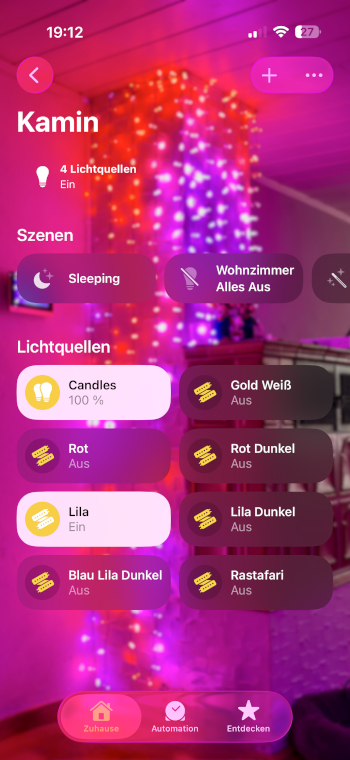
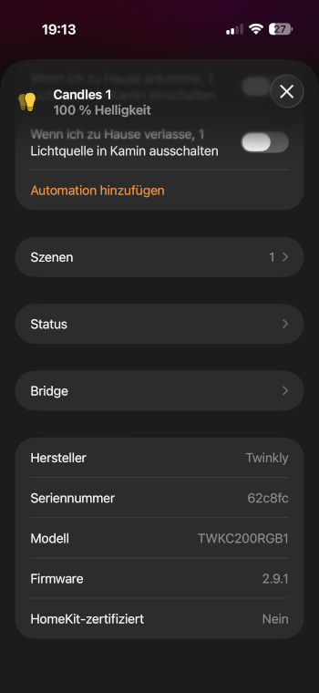
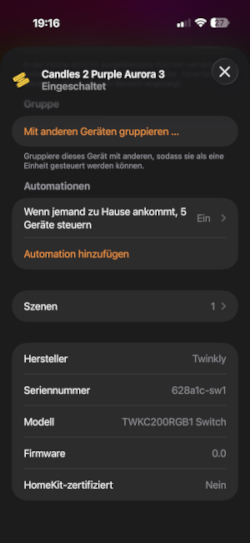
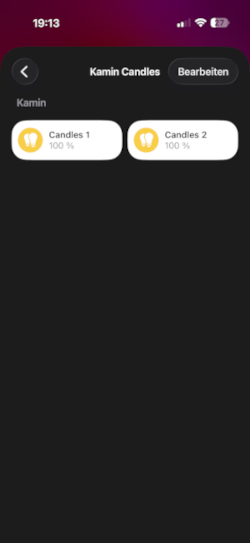
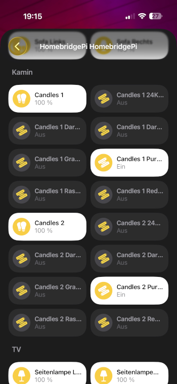

# homebridge-twinkly-candle

**Homebridge v2 Plugin für Twinkly Lichterketten** – optimiert für Candles (TWKC200RGB).

[](https://homebridge.io)
[](https://nodejs.org)  
-> Volle HomeKit-Unterstützung, inklusive Movie-Switches, Gruppen-Sync, Default-Movie bei "Ein" und/oder überschreibbar pro Gerät, ...


  
 

## Features

- ✅ **Homebridge v2 kompatibel** (HAP-NodeJS v1, `onGet`/`onSet` API)
- ✅ **Keine externen Abhängigkeiten** – nutzt ausschließlich Node.js built-ins (`http`, `dgram`, `crypto`)
- ✅ **Automatische UDP-Geräteerkennung** im lokalen Netzwerk
- ✅ **Ein/Aus**, **Helligkeit** und **Farbsteuerung** (Hue + Saturation)
- ✅ **Farbe via `/led/color`** (sauber, kein Movie-Upload nötig; fw ≥ 2.7.1)
- ✅ **Movie-Fallback** für ältere Firmware-Versionen
- ✅ **Movie-Switches** – ein HomeKit-Switch pro gespeichertem Twinkly-Effekt
- ✅ **Gruppen-Sync** – mehrere Twinkly-Geräte schalten sich gegenseitig
- ✅ **Automatische Token-Erneuerung** bei Ablauf (alle 4 h)
- ✅ **Apple Home optimiert** – Echo-Guard, suppress-Fenster und Stale-Timer verhindern UI-Flicker
- ✅ Manuelle Geräteliste als Fallback falls UDP blockiert ist
- ✅ Wiederholender Netzwerk-Scan und Movie-Poll konfigurierbar

## Getestete Geräte

| Modell                  | Firmware | Status               |
|-------------------------|----------|----------------------|
| TWKC200RGB (Candles)    | 2.9.1    | ✅ Getestet          |
| TWS250STP (Strings)     | 2.9.x    | ✅ Kompatibel        |
| Alle Gen-II Modelle     | ≥ 2.7.1  | ✅ Erwartet          |
| Gen-I Modelle           | beliebig | ✅ Fallback via Movie |

## Voraussetzungen

- Homebridge v1.6.0+ **oder** v2.0.0+
- Node.js ≥ 18
- Twinkly-Geräte im **gleichen WLAN-Netzwerk** wie Homebridge
- Empfohlen: **feste IP-Adressen** für Twinkly-Geräte im Router (DHCP-Reservierung)

## Installation

### Via Homebridge UI (empfohlen)

1. Homebridge UI öffnen → **Plugins** → Suche nach `homebridge-twinkly-candle`
2. Installieren und konfigurieren

### Manuell

```bash
sudo npm install -g homebridge-twinkly-candle
```

Homebridge neu starten.

## Konfiguration

### Minimal (empfohlen – Discovery automatisch)

```json
{
  "platforms": [
    {
      "platform": "TwinklyCandle",
      "name": "TwinklyCandle"
    }
  ]
}
```

### Vollständige Konfiguration

```json
{
  "platforms": [
    {
      "platform": "TwinklyCandle",
      "name": "TwinklyCandle",
      "enableBrightness": true,
      "enableColor": true,
      "enableMovieSwitches": true,
      "discoveryTimeout": 5,
      "scanInterval": 60,
      "requestTimeout": 3000,
      "moviePollInterval": 60,
      "defaultMovieName": "Candle Flicker",
      "devices": [
        { "ip": "192.168.1.101", "defaultMovieName": "Pink Aurora Fade" },
        { "ip": "192.168.1.102" }
      ]
    }
  ]
}
```

### Konfigurationsoptionen

| Option                | Typ     | Standard        | Beschreibung                                                        |
|-----------------------|---------|-----------------|---------------------------------------------------------------------|
| `name`                | string  | `TwinklyCandle` | Plugin-Name (intern)                                                |
| `enableBrightness`    | boolean | `true`          | Helligkeitsregler in Apple Home                                     |
| `enableColor`         | boolean | `true`          | Farbwähler in Apple Home                                            |
| `enableMovieSwitches` | boolean | `true`          | Einen HomeKit-Switch pro Movie/Effekt anlegen                       |
| `discoveryTimeout`    | integer | `5`             | Sekunden für UDP-Suche beim Start                                   |
| `scanInterval`        | integer | `60`            | Sekunden zwischen automatischen Scans (0 = deaktiviert)             |
| `requestTimeout`      | integer | `3000`          | HTTP-Timeout in Millisekunden                                       |
| `moviePollInterval`   | integer | `60`            | Sekunden zwischen Movie-Listen-Checks (0 = deaktiviert)             |
| `defaultMovieName`    | string  | –               | Name des Standard-Movies (global, wird beim Einschalten gestartet)  |
| `devices`             | array   | `[]`            | Manuelle Geräteliste mit `ip` und optional `defaultMovieName`       |

## Apple Home – Verhalten & Interna

### HAP Echo-Guard

Apple Home sendet nach jedem `updateCharacteristic(value)` intern ein Echo-`onSet(value)` zurück.
Das Plugin erkennt diese Echos anhand eines **suppress-Fensters (1500 ms)** und ignoriert sie.
`_lastSwitchDesired` merkt sich den gewünschten Zustand, damit `onGet` im Suppress-Fenster
den korrekten Wert zurückgibt – kein falsches ON/OFF-Flackern in der Home App.

### Movie-Switches

Für jeden auf dem Gerät gespeicherten Movie/Effekt wird ein eigener **HomeKit-Switch** angelegt:

- **Switch EIN** → Movie wird gestartet, alle anderen Switches desselben Geräts gehen AUS
- **Switch AUS** (bei aktivem Movie) → Gerät wird komplett ausgeschaltet
- **Switch AUS** (bei inaktivem Movie) → wird unterdrückt (kein doppeltes OFF)

### Gruppen-Sync

Mehrere Twinkly-Geräte können synchron gesteuert werden:

- Schaltet man Gerät A auf Movie X, spielt Gerät B nach ~1 s ebenfalls Movie X
- Schaltet man Gerät A aus, wird Gerät B ebenfalls ausgeschaltet
- `_isDeviceOff`-TTL (8 s) schützt vor ungewolltem Re-Sync kurz nach manuell-OFF

### Optimistischer State-Cache

Zustandsänderungen werden **sofort lokal gespeichert** (vor dem API-Call), damit
gleichzeitig eintreffende `onGet`-Anfragen von Apple Home sofort den richtigen Wert
bekommen. Der Cache läuft nach 8 Sekunden ab; danach wird der echte Gerätezustand
per API abgefragt.

## Twinkly API

Dieses Plugin nutzt die inoffizielle Twinkly REST API:

- `GET /xled/v1/gestalt` – Geräteinfo (ohne Auth)
- `POST /xled/v1/login` + `POST /xled/v1/verify` – Bearer-Token Auth
- `GET/POST /xled/v1/led/mode` – Betriebsmodus (`off` / `movie` / `playlist` / `color`)
- `GET/POST /xled/v1/led/out/brightness` – Helligkeit (0–100)
- `GET/POST /xled/v1/led/color` – Farbe (HSV, fw ≥ 2.7.1)
- `GET /xled/v1/movies` – Liste aller gespeicherten Movies
- `GET/POST /xled/v1/movies/current` – Aktiver Movie
- `GET/POST /xled/v1/playlist/current` – Aktiver Playlist-Eintrag
- UDP-Broadcast Port 5555 – Automatische Geräteerkennung

API-Dokumentation: https://xled-docs.readthedocs.io/en/latest/rest_api.html

## Problemlösungen

### Gerät wird nicht gefunden (Discovery)

1. Prüfen ob Twinkly-Gerät und Homebridge im **gleichen WLAN-Netz** sind
2. Prüfen ob UDP-Broadcasts auf dem Router/Switch zugelassen sind
3. IP-Adresse manuell in der Konfiguration unter `devices` eintragen
4. `discoveryTimeout` erhöhen (z. B. auf `10`)

### Feste IP-Adresse im Router

Empfohlen: Im Router (FRITZ!Box, etc.) für jede Twinkly-Lichterkette eine DHCP-Reservierung
anhand der MAC-Adresse einrichten, sodass die IP stabil bleibt.

### Switches flackern in Apple Home

- Sicherstellen dass `requestTimeout` ≥ 3000 ms gesetzt ist
- Debug-Logging aktivieren (`-D` in Homebridge) um Echo-Guard-Meldungen zu sehen
- WLAN-Signalstärke der Twinkly-Geräte prüfen

### Farbe ändert sich nicht

Firmware ≥ 2.7.1 erforderlich. Das Plugin fällt automatisch auf Movie-Upload zurück,
falls `/led/color` nicht verfügbar ist.

### Movie-Switches fehlen in Apple Home

1. `enableMovieSwitches: true` in der Konfiguration setzen
2. Prüfen ob Movies auf dem Gerät in der Twinkly-App gespeichert sind
3. `moviePollInterval` auf z. B. `60` setzen damit neue Movies automatisch erkannt werden
4. Homebridge neu starten

## Lizenz

MIT License

## Credits

- Twinkly API Dokumentation: [xled-docs](https://xled-docs.readthedocs.io) von Pavol Babinčák
- Inspiration: [homebridge-twinkly-plus](https://github.com/vanHoesel/homebridge-twinkly-plus)
